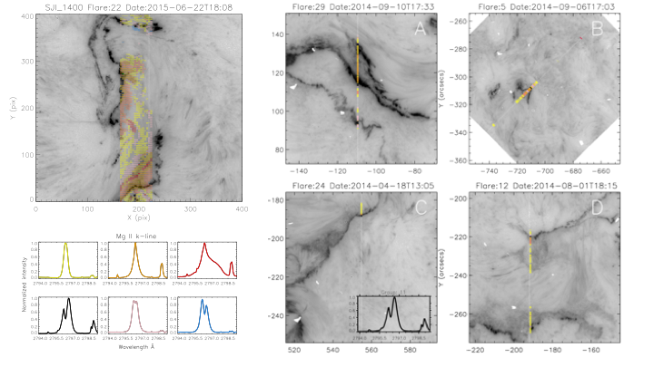

# flare-clustering
We used the k-means algorithm to efficiently analyze millions of Mg II spectra collected from a large dataset of solar flares. 
The k-means algorithm is a simple example of a vector quantization, whereby centroids are used to represent a collection of similar looking data.
This method generalizes the idea of binning, where small high frequency variations can be safely ignored, allowing one to extend from scalars too 
abstract vectorial objects such as shapes. We found similar spectral pattern’s over our entire dataset, including a universal flaring profile and 
ribbon front profiles that appear co-temporal and spatial with X-ray signatures of both GOES and RHESSI. This continuity of the results across
flare events suggests shared chromospheric physics. 

***Images shows group clusters superinposed over IRIS SJI's for five different flares. Six of the 52 centroids found can be seen in the lower left 
corner of the figure. The colours in the SJI imply that the emission from a particular region is most similar to the centroid of the corresponding colour*** 
